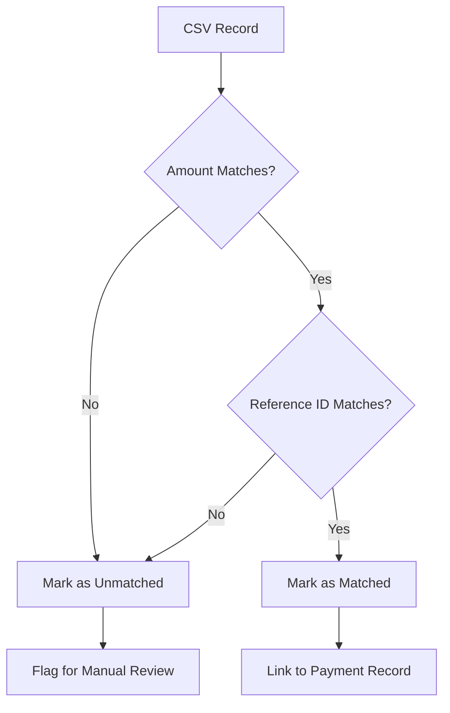

# Reconciliation Documentation

## Overview

The reconciliation engine matches external transaction data (CSV files from banks/payment gateways) with internal payment records to ensure financial accuracy and identify discrepancies.

## CSV Schema

### Required Format

The system accepts CSV files with the following mandatory columns:

```csv
external_transaction_id,amount,currency,transaction_date
PAY_12345,10000,USD,2025-01-01T10:30:00Z
PAY_67890,5000,EUR,2025-01-01T14:45:00Z
```

### Column Specifications

| Column | Type | Required | Description | Example |
|--------|------|----------|-------------|---------|
| `external_transaction_id` | String | Yes | Unique transaction identifier from external system | `PAY_12345`, `TXN_ABC123` |
| `amount` | Integer | Yes | Amount in smallest currency unit (cents, pence, etc.) | `10000` (= $100.00) |
| `currency` | String | Yes | ISO 4217 currency code | `USD`, `EUR`, `GBP` |
| `transaction_date` | ISO DateTime | Yes | Transaction timestamp in ISO 8601 format | `2025-01-01T10:30:00Z` |

### Optional Columns

Additional columns are ignored but can be included:

```csv
external_transaction_id,amount,currency,transaction_date,description,fee,merchant_id
PAY_12345,10000,USD,2025-01-01T10:30:00Z,"Product Purchase",250,MERCH_001
```

### Sample CSV Files

**Bank Statement Format:**
```csv
external_transaction_id,amount,currency,transaction_date
TXN_BANK_001,15000,USD,2025-01-01T09:15:00Z
TXN_BANK_002,7500,USD,2025-01-01T11:22:00Z
TXN_BANK_003,12000,USD,2025-01-01T15:33:00Z
```

**Gateway Export Format:**
```csv
external_transaction_id,amount,currency,transaction_date
stripe_pi_1234567890,25000,USD,2025-01-01T08:45:00Z
stripe_pi_0987654321,8000,USD,2025-01-01T12:10:00Z
```

---

## Matching Rules & Heuristics

### Primary Matching Algorithm

The reconciliation engine uses a **two-factor exact match** approach:

1. **Amount Match**: `reconciliation_record.amount = payment.amount_cents`
2. **Reference Match**: `reconciliation_record.external_transaction_id = payment.external_payment_id`

**Both conditions must be true for a successful match.**

### Matching Logic Flow



### Match Prioritization

When multiple payments could match a single CSV record:

1. **Exact Match**: Same amount + same reference ID
2. **Date Proximity**: Closest transaction date (future enhancement)
3. **Manual Review**: Flag ambiguous matches

### Edge Cases & Handling

#### 1. Duplicate External IDs
**Scenario**: Multiple payments with same `external_payment_id`

**Resolution**:
- Match to the **most recent** payment
- Flag others for manual review
- Log all potential matches in `reconciliation_details`

```sql
-- Duplicate detection query
SELECT external_payment_id, COUNT(*) as duplicate_count
FROM payments 
GROUP BY external_payment_id 
HAVING COUNT(*) > 1;
```

#### 2. Amount Discrepancies
**Scenario**: Reference ID matches but amount differs

**Resolution**:
- Mark as `unmatched` 
- Store both amounts in `reconciliation_details`
- Require manual investigation

**Common Causes**:
- Currency conversion differences
- Fee deductions
- Partial refunds
- Data entry errors

#### 3. Missing Reference IDs
**Scenario**: CSV record has empty `external_transaction_id`

**Resolution**:
- Skip automatic matching
- Log as `no_reference_id` reason
- Require manual matching by amount + date

#### 4. Orphaned CSV Records
**Scenario**: CSV record doesn't match any payment

**Resolution**:
- Mark as `unmatched`
- Flag for investigation
- Possible causes: failed payments, external refunds, data sync issues

#### 5. Orphaned Payments
**Scenario**: Payment exists but no corresponding CSV record

**Resolution**:
- Identify via reconciliation report
- Check payment status (failed payments won't appear in bank statements)
- Investigate pending transactions

---

## Reconciliation Process

### 1. CSV Upload Phase

```javascript
// Frontend CSV parsing
const parseCSV = (file) => {
  return new Promise((resolve, reject) => {
    Papa.parse(file, {
      header: true,
      skipEmptyLines: true,
      transform: (value, header) => {
        // Convert amount to integer (cents)
        if (header === 'amount') {
          return parseInt(value);
        }
        return value;
      },
      complete: (results) => {
        // Validate required columns
        const requiredColumns = ['external_transaction_id', 'amount', 'currency', 'transaction_date'];
        const hasRequiredColumns = requiredColumns.every(col => 
          results.meta.fields.includes(col)
        );
        
        if (!hasRequiredColumns) {
          reject(new Error('Missing required columns'));
          return;
        }
        
        resolve(results.data);
      },
      error: reject
    });
  });
};
```

### 2. Data Storage Phase

```sql
-- Insert CSV records
INSERT INTO reconciliation_records (
  uploaded_by,
  file_name,
  external_transaction_id,
  amount,
  currency,
  transaction_date,
  status
) VALUES (
  $1, $2, $3, $4, $5, $6, 'unmatched'
);
```

### 3. Matching Phase

```sql
-- Core matching query
UPDATE reconciliation_records 
SET 
  status = 'matched',
  matched_payment_id = p.id
FROM payments p
WHERE reconciliation_records.amount = p.amount_cents
  AND reconciliation_records.external_transaction_id = p.external_payment_id
  AND reconciliation_records.uploaded_by = p.user_id
  AND reconciliation_records.status = 'unmatched';
```

### 4. Results Analysis

```javascript
// Calculate reconciliation metrics
const analyzeResults = (records) => {
  const total = records.length;
  const matched = records.filter(r => r.status === 'matched').length;
  const unmatched = total - matched;
  const matchRate = total > 0 ? (matched / total * 100).toFixed(1) : 0;
  
  return {
    total_records: total,
    matched,
    unmatched,
    match_rate: matchRate,
    discrepancies: unmatched
  };
};
```

---

## Exception Handling

### Unmatched Items Surface Strategy

#### 1. Dashboard Display

**Reconciliation Summary Card:**
```typescript
interface ReconciliationSummary {
  total_records: number;
  matched: number;
  unmatched: number;
  match_rate: string; // percentage
  exceptions: UnmatchedException[];
}

interface UnmatchedException {
  id: string;
  external_transaction_id: string;
  amount: number;
  currency: string;
  reason: 'no_payment_found' | 'amount_mismatch' | 'duplicate_reference';
  suggested_actions: string[];
}
```

**Exception Display:**
- Red badge for unmatched items
- Expandable details showing specific reasons
- Suggested resolution actions
- Manual match interface

#### 2. Exception Categories

**Category 1: No Payment Found**
- CSV record exists but no matching payment
- Possible causes: Failed payment, external refund, data lag
- Action: Investigate payment gateway logs

**Category 2: Amount Mismatch**
- Reference ID matches but amounts differ
- Show both amounts side by side
- Action: Check for fees, currency conversion, partial refunds

**Category 3: Multiple Matches**
- One CSV record matches multiple payments
- Show all potential matches
- Action: Manual selection or investigation

**Category 4: Missing Reference**
- CSV record lacks external transaction ID
- Action: Manual matching by amount + date range

### Manual Resolution Interface

```typescript
// Manual match interface
const ManualMatchDialog = ({ unmatchedRecord, potentialMatches }) => (
  <Dialog>
    <DialogContent>
      <h3>Manual Reconciliation</h3>
      
      <div className="csv-record">
        <h4>CSV Record:</h4>
        <p>ID: {unmatchedRecord.external_transaction_id}</p>
        <p>Amount: {formatCurrency(unmatchedRecord.amount)}</p>
        <p>Date: {formatDate(unmatchedRecord.transaction_date)}</p>
      </div>
      
      <div className="potential-matches">
        <h4>Potential Matches:</h4>
        {potentialMatches.map(payment => (
          <div key={payment.id} className="match-option">
            <input 
              type="radio" 
              name="manual-match" 
              value={payment.id}
            />
            <label>
              {payment.external_payment_id} - 
              {formatCurrency(payment.amount_cents)} - 
              {formatDate(payment.created_at)}
            </label>
          </div>
        ))}
      </div>
      
      <div className="actions">
        <Button onClick={confirmManualMatch}>Confirm Match</Button>
        <Button onClick={markAsException}>Mark as Exception</Button>
      </div>
    </DialogContent>
  </Dialog>
);
```

---

## Advanced Reconciliation Features

### 1. Fuzzy Matching (Future Enhancement)

For partial matches when exact matching fails:

```sql
-- Fuzzy amount matching (within 1% tolerance)
SELECT r.*, p.*
FROM reconciliation_records r
CROSS JOIN payments p
WHERE r.status = 'unmatched'
  AND ABS(r.amount - p.amount_cents) <= (p.amount_cents * 0.01)
  AND r.external_transaction_id ILIKE '%' || p.external_payment_id || '%'
```

### 2. Batch Processing

For large CSV files:

```javascript
// Process in chunks to avoid memory issues
const processBatchReconciliation = async (csvData, batchSize = 100) => {
  const batches = chunk(csvData, batchSize);
  
  for (const batch of batches) {
    await processReconciliationBatch(batch);
    // Add delay to prevent database overload
    await new Promise(resolve => setTimeout(resolve, 100));
  }
};
```

### 3. Currency Conversion

Handle multi-currency reconciliation:

```sql
-- Convert amounts using exchange rates table
SELECT r.*, p.*, 
  CASE 
    WHEN r.currency = p.currency THEN r.amount
    ELSE ROUND(r.amount * ex.rate)
  END as normalized_amount
FROM reconciliation_records r
JOIN payments p ON p.external_payment_id = r.external_transaction_id
LEFT JOIN exchange_rates ex ON ex.from_currency = r.currency 
  AND ex.to_currency = p.currency
  AND ex.date = DATE(r.transaction_date);
```

### 4. Reconciliation Scheduling

Automated daily reconciliation:

```javascript
// Scheduled reconciliation job
const scheduledReconciliation = async () => {
  // Find unprocessed files uploaded in last 24 hours
  const recentUploads = await getRecentReconciliationUploads();
  
  for (const upload of recentUploads) {
    try {
      await runAutomatedReconciliation(upload.user_id, upload.file_name);
      await notifyUserOfResults(upload.user_id);
    } catch (error) {
      await logReconciliationError(upload.id, error);
    }
  }
};
```

---

## Reconciliation Reports

### Summary Report

```typescript
interface ReconciliationReport {
  period: string;
  total_csv_records: number;
  total_payments: number;
  matched_count: number;
  unmatched_csv_count: number;
  orphaned_payments_count: number;
  match_rate_percentage: number;
  discrepancy_amount: number;
  exceptions_by_category: {
    no_payment_found: number;
    amount_mismatch: number;
    multiple_matches: number;
    missing_reference: number;
  };
}
```

### Exception Detail Report

```sql
-- Exception summary query
SELECT 
  rd.reason,
  COUNT(*) as exception_count,
  SUM(rr.amount) as total_amount,
  AVG(rr.amount) as avg_amount
FROM reconciliation_details rd
JOIN reconciliation_records rr ON rd.payment_id IS NULL
GROUP BY rd.reason
ORDER BY exception_count DESC;
```

### Daily Reconciliation Health Check

```sql
-- Daily reconciliation metrics
WITH daily_stats AS (
  SELECT 
    DATE(created_at) as reconciliation_date,
    COUNT(*) as total_records,
    COUNT(CASE WHEN status = 'matched' THEN 1 END) as matched_count,
    COUNT(CASE WHEN status = 'unmatched' THEN 1 END) as unmatched_count
  FROM reconciliation_records
  WHERE created_at >= CURRENT_DATE - INTERVAL '30 days'
  GROUP BY DATE(created_at)
)
SELECT 
  reconciliation_date,
  total_records,
  matched_count,
  unmatched_count,
  ROUND(matched_count::numeric / total_records * 100, 1) as match_rate_pct
FROM daily_stats
ORDER BY reconciliation_date DESC;
```